[← Back to README](../README.md)

# Terminal UI

- [Install and launch](#install-and-launch)
- [How the project is resolved](#how-the-project-is-resolved)
- [The project tree](#the-project-tree)
- [The eight tabs](#the-eight-tabs)
  - [0 · Home](#0--home)
  - [1 · Memory](#1--memory)
  - [2 · Tasks](#2--tasks)
  - [3 · Evidence](#3--evidence)
  - [4 · Benchmarks](#4--benchmarks)
  - [5 · Runbooks](#5--runbooks)
  - [6 · Graph](#6--graph)
  - [7 · Settings](#7--settings)
- [The search palette](#the-search-palette)
- [Keymap](#keymap)
  - [Global keys](#global-keys)
  - [Overlay keys](#overlay-keys)
  - [Per-screen keys](#per-screen-keys)
- [Mouse](#mouse)
- [Theming](#theming)
  - [Which palette opens](#which-palette-opens)
  - [The theme picker](#the-theme-picker)
  - [engram theme](#engram-theme)
  - [The theme document](#the-theme-document)
  - [Editing a palette in SQL](#editing-a-palette-in-sql)
- [Icons](#icons)
- [What the workspace remembers](#what-the-workspace-remembers)
- [Regenerating the captures and the goldens](#regenerating-the-captures-and-the-goldens)
- [Troubleshooting](#troubleshooting)

---

`engram tui` is a project workspace: eight tabs — **Home**, **Memory**, **Tasks**, **Evidence**,
**Benchmarks**, **Runbooks**, **Graph**, **Settings** — over the same SQLite store the CLI and the
MCP server read, plus three overlays that work on every one of them: a project tree, a workspace
search palette and a theme picker.

There is no separate selector screen and no screen the root draws for itself. Home is a tab like
the rest, reachable with `0`; the project tree is an overlay on `ctrl+p`; sync configuration is a
row inside Settings.

## Install and launch

```bash
brew install HoracioEspinosa/tap/engram-custom
```

No `--cask`: the tap ships a Homebrew **formula** for both macOS and Linux. See
[INSTALLATION.md](INSTALLATION.md) for the other install paths (source, downloaded binary,
Windows).

```bash
engram tui
engram tui --project koi-garden
engram tui --theme koi-day
engram tui --no-mouse
```

`--project`, `--theme` and `--no-mouse` can be combined in any order. `--no-mouse` is not listed by
`engram help`; it is read straight off the command line by the mouse resolver.

## How the project is resolved

The workspace opens on one project, chosen in this order:

1. `--project <slug>` (or `--project=<slug>`) on the command line.
2. `ENGRAM_PROJECT`.
3. Detection from the working directory — **only** when the detector backs it with a fact (a git
   remote or a repo config). A bare directory-name guess counts as no detection at all.
4. `tui.last_project`, the project the previous run was left on.
5. Nothing. The workspace then opens with the project tree already on screen, composited over Home.

Detection outranks the remembered project on purpose: opening a terminal inside a repository and
being shown somebody else's workspace is the one failure a remembered choice must not cause.

A resolved slug is normalised, and a normalisation warning is printed to stderr.

## The project tree

`ctrl+p` opens the forest of enrolled project cards — parents and their children, not a flat list —
with three counters per row: observations, open tasks, evidence files.

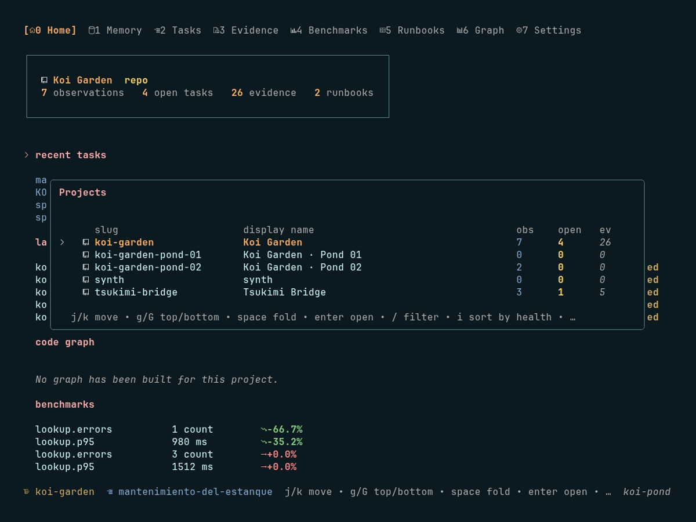

- `j` / `k` (or the arrows) move, `g` / `G` jump to either end.
- `space` folds and unfolds a node. A leaf has nothing to fold and is left alone.
- `/` focuses the filter. It is fuzzy and matches a project's slug, display name, tags and aliases;
  the slug and the name are highlighted where they matched. A parent kept on screen only because a
  descendant matched is drawn de-emphasised. While a filter is active, folds are ignored — a hit
  under a folded parent would otherwise be invisible.
- `i` sorts each level by health: most stale runbooks first, then most open tasks, then most
  observations.
- `r` reloads the forest.
- `enter` opens the project under the cursor. Every project-scoped tab is rescoped, the workspace
  lands on Home, and the slug is written to `tui.last_project`.
- `esc` (or `ctrl+p` again) closes the overlay **even with no project chosen**. Memory reads
  workspace-wide and works unscoped; the project-scoped tabs render their own empty state.

The overlay opens with its cursor on the project already active, so `ctrl+p` starts where the
reader is rather than at the top of the forest.

## The eight tabs

Digits `0`–`7` jump straight to a tab; `tab` and `shift+tab` cycle, wrapping at either end. A tab
whose data was loaded seconds ago is shown as it is — switching tabs does not re-query — while `r`
always reloads the screen on display.

Below 100 columns the tab bar drops the labels and shows only each slot's glyph and digit.

### 0 · Home

The active project seen whole: its card and breadcrumb as a header, then four navigable blocks —
**recent tasks**, **latest evidence**, **code graph**, **benchmarks** — five rows each. Wide
terminals draw them as two columns (tasks and evidence on the left, graph and benchmarks on the
right); narrow ones concatenate them into one list.

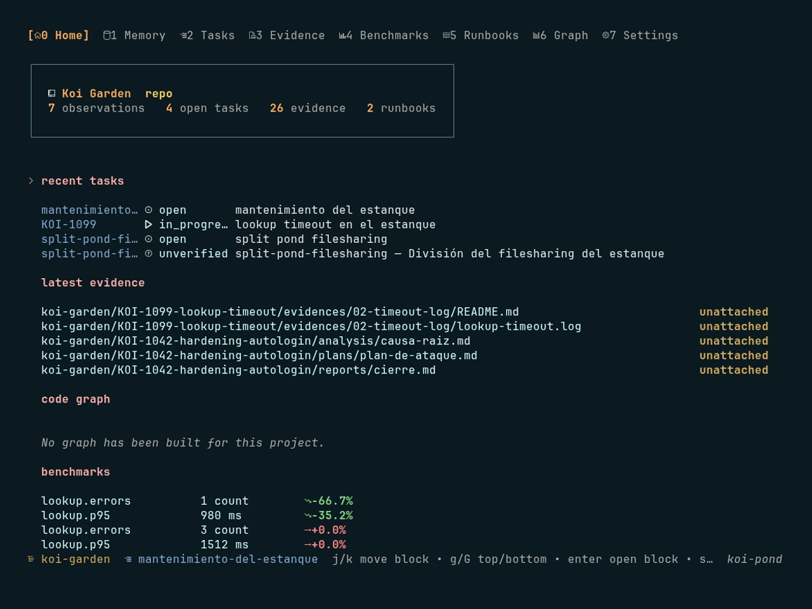

`enter` opens the block under the cursor in its own tab, so every summary leads somewhere. `s` runs
a graph sync from here without leaving Home.

### 1 · Memory

The observation, session and timeline workspace: a dashboard menu (search, recent observations,
sessions, agent setup, cloud sync settings, quit), full-text search with paging, observation
detail, the topic-key timeline, session list and session detail, and the agent-setup installer.

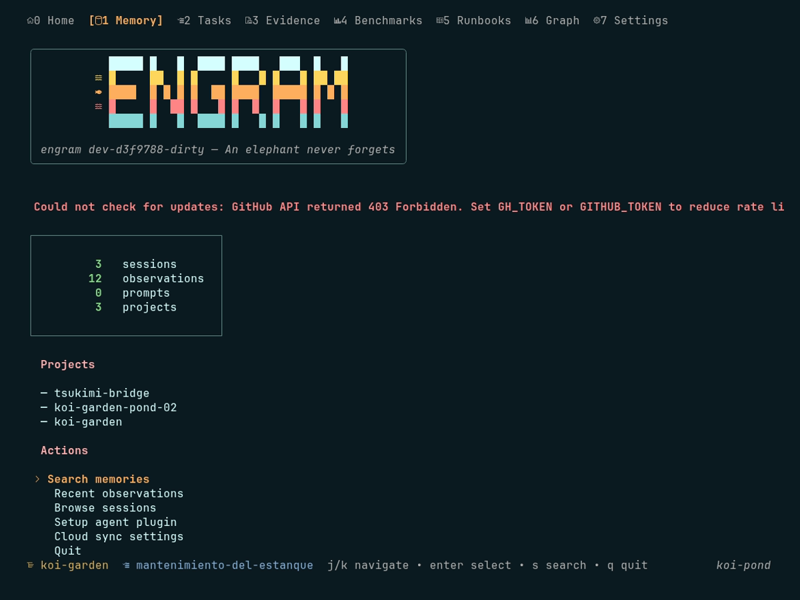

Memory opens **workspace-wide**: it is the one tab that answers with no project resolved. `a`
cycles the scope `all` → `project` → `subtree` → `all`, and the tab's own title carries it —
`Memory (project)`, `Memory (subtree)`, plain `Memory` for `all`. With no active project the key is
inert and the hint disappears rather than advertising a narrowing that has nothing to narrow to.
Changing the scope resets the list offsets, so the reader never lands on a page that no longer
exists. The choice lasts for the session: the tab is built without a settings store, so every start
opens at `all` again.

`L` links the observation under the cursor to a task; `t` opens its topic-key timeline; `c` copies
it to the clipboard through OSC 52.

### 2 · Tasks

The project's tasks, its detail, and the context pack it builds.

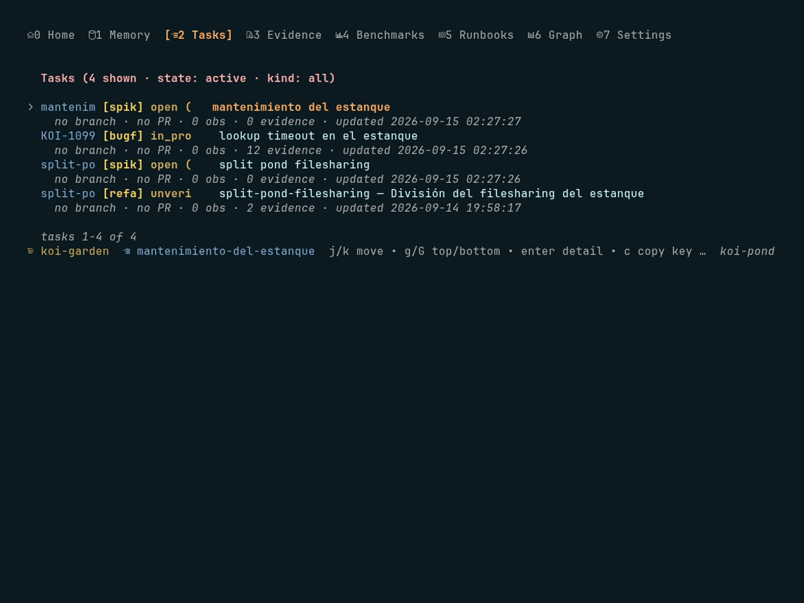

The list filters by state (`f`) and kind (`K`), searches with `/`, and pages with `p` / `n`.

`enter` opens a task's detail: its Jira fields, branch and PR, the observations linked to it and
its evidence.

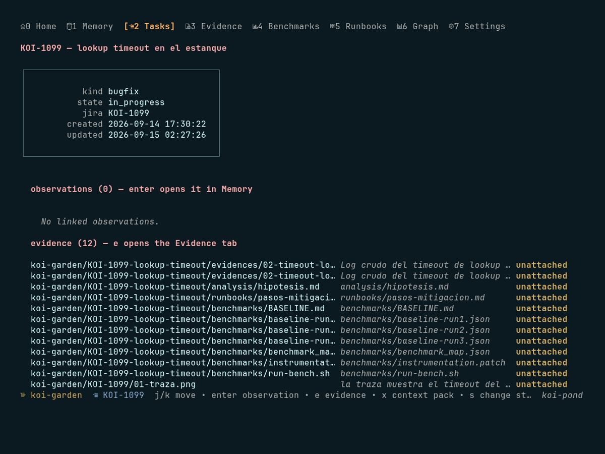

From the detail, `e` opens Evidence filtered to this task, `enter` on a linked observation opens it
inside Memory, `s` changes the task's state, `l` links another observation, `o` opens the Jira
issue, `u` the pull request, `b` copies the branch name and `c` the task key.

`x` builds the **context pack** — the same bundle `mem_context_pack` returns — rendered for
reading, copying (`c`) or writing to disk (`w`, as `context-pack.md` under the evidence root). The
pack's own body is written in Spanish regardless of the workspace chrome around it; that mirrors
the vault's documentation-language convention, not a translation bug.

### 3 · Evidence

Every file the project has captured, optionally filtered to one task (`t`) or to attached-only
(`a`).

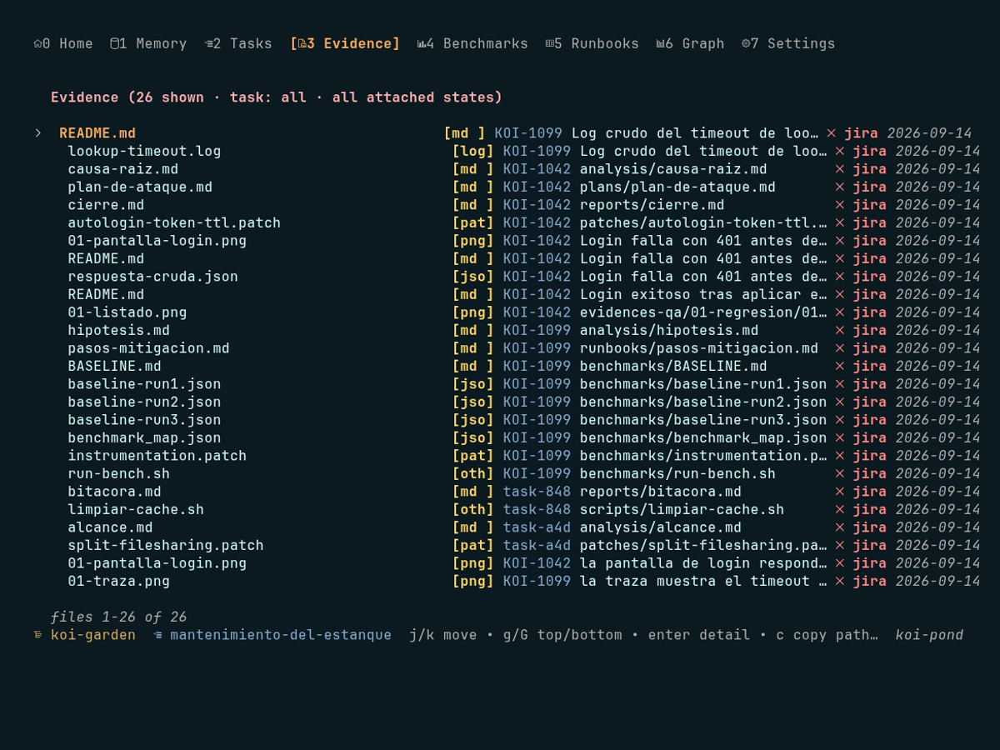

`enter` opens a file's record: path, sha256, size, what it proves, whether it is attached to the
Jira issue, and whatever a sibling `manifest.json` adds (`m`). `o` opens the file with the OS's own
viewer; `c` copies the sha256 and `p` the path, so a machine with no desktop still gets the value
out. `enter` on the detail screen opens that file's task inside Tasks.

Paths are resolved against `${CD_EVIDENCE_DIR:-~/.clarodrive/evidence}`.

### 4 · Benchmarks

Every measurement the project has recorded, next to the baseline of its own metric. It is the one
screen built on a real table: five fields per row, read down a column.

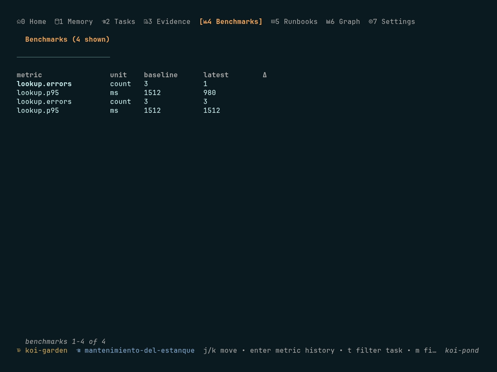

`t` filters by task and `m` by metric — both open a prompt where `enter` applies and `esc`
cancels. `enter` on a row opens that metric's history. `b` opens the project's `BASELINE.md` with
the system viewer. `p` and `n` page, and each is advertised only when there is a page to reach.

### 5 · Runbooks

The runbook index — `RB-NNN`, category, pattern, status, and a stale badge with its age — and one
runbook's Markdown rendered with `glamour`.

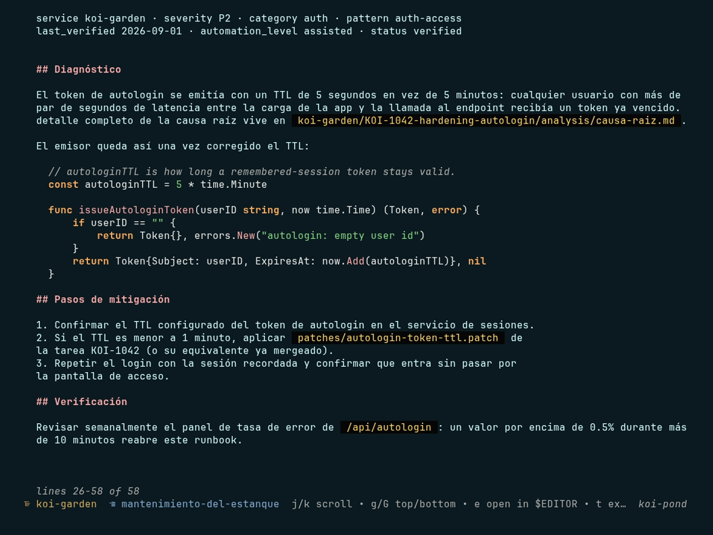

On the index, `a` toggles between this project and every project, `/` searches, `t` opens Memory
pre-searched for that runbook's recorded executions, and `c` copies the vault path.

In the Markdown view, `e` opens the file in `$EDITOR`, `o` opens the project's knowledge hub, `r`
re-reads the file from disk and `t` again jumps to the executions in Memory. The TUI never writes
to the vault.

**`ENGRAM_VAULT_ROOT`**: this view reads the runbook's file from a local checkout of the knowledge
vault, joined with the row's own `vault_path`. The variable is **required and has no default** — a
guessed path that happens not to exist would fail silently and read as "the runbook isn't cloned"
when the real problem is that nobody set the variable. Unset, the view says so by name; set to a
checkout that does not hold the file, it names that path and says the runbook is not cloned locally
there. The two messages are deliberately different: one is a configuration gap, the other a missing
checkout.

Rendering does not strip the note's YAML frontmatter, so the block above the title (`id:`,
`symptoms:`, `tags:`, …) repeats as plain text the metadata the styled summary line already shows.

### 6 · Graph

What the project's code graph currently says about itself: fresh or stale (with the store's own
reason and the count of changed files), nodes, edges, communities, the commit it was built at, when
it was built and when it was last checked; the most connected **god nodes**; and the observations
written against a node of that graph, paged with `p` / `n`.

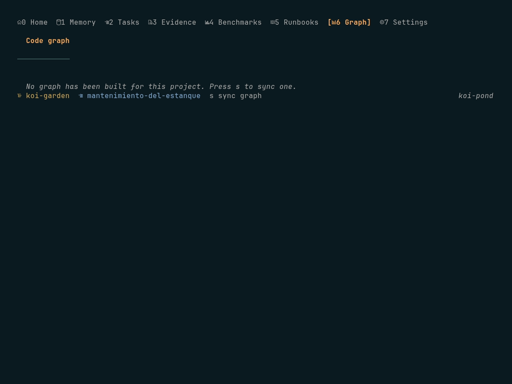

`s` runs a graph sync against the checkout `engram tui` was launched from. The tab renders the
store's verdict and never forms one of its own — recomputing staleness here would give the
workspace a second opinion that could disagree with the CLI and the MCP tools.

### 7 · Settings

Everything the workspace remembers about itself, in one place. The Cloud tab was folded in here:
sync configuration is a row, not a tab.

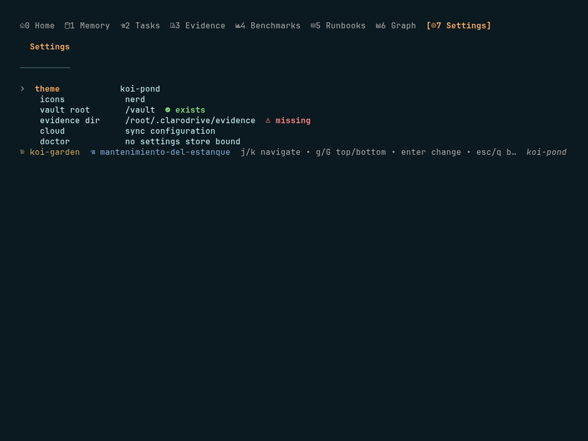

| Row | Shows | `enter` |
| --- | --- | --- |
| theme | the active palette's name | opens the theme picker |
| icons | the active glyph vocabulary | cycles `unicode` → `nerd` → `ascii` |
| vault root | `ENGRAM_VAULT_ROOT`, marked *exists* or *missing* | — |
| evidence dir | the resolved evidence root, marked the same way | — |
| cloud | sync configuration | opens the sync sub-screen |
| doctor | how many `tui.*` settings are remembered | — |

The vault root, evidence dir and doctor rows are readings, not actions: the place to change them is
the environment they were read from, and the full diagnostic is `engram doctor`.

This tab is built without a settings store bound to it, which shows in two rows: cycling `icons`
changes the vocabulary for the rest of the session and then reports that it could not remember the
choice, and `doctor` reads *no settings store bound* instead of counting. Set `ENGRAM_TUI_ICONS`,
or write `tui.icons` directly, to make an icon choice survive a restart.

## The search palette

`ctrl+k` opens one query across everything the workspace holds. It also answers `/` on any screen
that does not claim that key for a search of its own — the rule is read off each screen's declared
keys, so Home, Evidence, Benchmarks, Graph and Settings answer `/` with the palette, while the
Memory dashboard and search results, the Tasks list and the Runbooks index keep it.

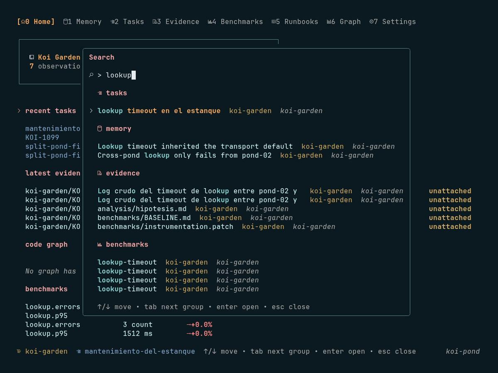

- A query is run at **two characters** or more, after a 100 ms pause. Below that the palette shows
  the last queries instead of a blank page.
- Results are grouped by kind, at most **five per group**, with the rest reported as `+N more`.
- With a project active the search is scoped to that project's subtree; with none, it is
  workspace-wide.
- `enter` opens the hit where it lives. A hit in another project rescopes the whole workspace
  first, so the row can be found again.

A leading `<letter>:` chip narrows the search to one kind. A prefix nobody declared is not a prefix
— `http://…` stays part of the query rather than becoming a broken `h:` search.

| Prefix | Kind | Opens in |
| --- | --- | --- |
| `p:` | projects | Home (rescoped) |
| `t:` | tasks | Tasks |
| `m:` | memory | Memory |
| `e:` | evidence | Evidence |
| `b:` | benchmarks | Benchmarks |
| `r:` | runbooks | Runbooks |

Opening a hit remembers the query: the last **ten** are kept, newest first and without duplicates,
under the `tui.search_history` setting.

## Keymap

### Global keys

These are answered by the chrome before the active tab sees the key. Every one of them except
`ctrl+c` is suspended while the screen has a text input focused, so a digit typed into a search box
reaches the box.

| Key | Action |
| --- | --- |
| `ctrl+c` | Quit, from anywhere — including a focused input |
| `0` … `7` | Home / Memory / Tasks / Evidence / Benchmarks / Runbooks / Graph / Settings |
| `tab` / `shift+tab` | Next / previous tab, wrapping |
| `ctrl+p` | Project tree |
| `ctrl+k` | Search palette |
| `ctrl+t` | Theme picker |
| `r` | Reload the screen on display |
| `?` | Help overlay — the chrome's keys plus whatever the *current* screen declares |
| `shift`+drag | The terminal's own selection, for copying (see [Mouse](#mouse)) |

The help overlay closes with `?`, `esc` or `q`, and swallows every other key while it is open.

### Overlay keys

| Key | Project tree (`ctrl+p`) | Theme picker (`ctrl+t`) | Palette (`ctrl+k`) |
| --- | --- | --- | --- |
| move | `j` / `k`, `g` / `G` | `j` / `k` (previews as it moves) | `↑` / `↓`, `ctrl+p` / `ctrl+n` |
| filter | `/` | `/` | type in the box |
| act | `enter` opens the project | `enter` applies the theme | `enter` opens the hit |
| extra | `space` fold · `i` sort by health · `r` refresh | `R` reload from the store | `tab` next group |
| close | `esc` or `ctrl+p` | `esc` or `ctrl+t` (restores the palette on screen) | `esc` or `ctrl+k` |

### Per-screen keys

**Home**

| Key | Action |
| --- | --- |
| `j` / `k` | Move between blocks |
| `h` / `l` | Move between columns — listed only when the width actually draws two |
| `g` / `G` | First / last block |
| `enter` | Open the block's tab |
| `s` | Sync the code graph |

**Memory** — the bindings change with the screen on display.

| Screen | Keys |
| --- | --- |
| Dashboard | `j` / `k` · `enter` select · `s` or `/` search · `q` quit |
| Search box | `enter` search · `esc` back |
| Search results | `j` / `k` · `g` / `G` · `enter` detail · `c` copy · `t` timeline · `L` link to task · `p` / `n` page · `a` scope · `/` search again · `esc` / `q` back |
| Recent | as above, without `/` |
| Observation detail | `j` / `k` scroll · `c` copy · `t` timeline · `L` link to task · `esc` / `q` back |
| Timeline | `j` / `k` scroll · `esc` / `q` back |
| Sessions | `j` / `k` · `g` / `G` · `enter` view · `d` delete (`y` / `n` confirm) · `a` scope · `esc` / `q` back |
| Session detail | `j` / `k` · `enter` detail · `c` copy · `t` timeline · `esc` / `q` back |
| Setup | `j` / `k` · `enter` install · `esc` / `q` back (`y` / `n` on the allowlist prompt) |

**Tasks**

| Screen | Keys |
| --- | --- |
| List | `j` / `k` · `g` / `G` · `h` / `l` pane focus · `enter` detail · `c` copy key · `o` open Jira · `/` search · `f` state filter · `K` kind filter · `p` / `n` page · `r` refresh · `esc` / `q` back |
| Detail | `j` / `k` · `enter` observation · `e` evidence · `x` context pack · `s` change state · `l` link observation · `c` copy key · `o` Jira · `u` PR · `b` copy branch · `r` refresh · `esc` / `q` back |
| Context pack | `j` / `k` scroll · `c` copy to clipboard · `w` write `context-pack.md` · `r` rebuild · `esc` / `q` back |

**Evidence**

| Screen | Keys |
| --- | --- |
| List | `j` / `k` · `g` / `G` · `enter` detail · `c` copy path · `o` open file · `t` filter by task · `a` toggle attached · `p` / `n` page · `r` refresh · `esc` / `q` back |
| Detail | `o` open with system viewer · `c` copy sha256 · `p` copy path · `m` manifest · `enter` task · `r` refresh · `esc` / `q` back |

**Benchmarks**

| Screen | Keys |
| --- | --- |
| Table | `j` / `k` · `enter` metric history · `t` filter by task · `m` filter by metric · `b` open `BASELINE.md` · `p` / `n` page, each shown only when that page exists |
| Metric history | `esc` / `q` back |
| Filter prompt | `enter` apply · `esc` cancel |

**Runbooks**

| Screen | Keys |
| --- | --- |
| Index | `j` / `k` · `g` / `G` · `enter` view · `c` copy vault path · `a` all / project · `/` search · `t` executions in Memory · `p` / `n` page · `r` refresh · `esc` / `q` back |
| Markdown view | `j` / `k` scroll · `g` / `G` · `e` open in `$EDITOR` · `t` executions in Memory · `c` copy vault path · `o` open hub · `r` reload · `esc` / `q` back |

**Graph**

| Key | Action |
| --- | --- |
| `s` | Sync the graph |
| `p` / `n` | Page the linked observations, each shown only when that page exists |

**Settings**

| Screen | Keys |
| --- | --- |
| List | `j` / `k` · `g` / `G` · `enter` change · `esc` / `q` back to Home |
| Cloud | `j` / `k` · `enter` select · `esc` / `q` back |

## Mouse

The workspace opens with the mouse enabled in **cell motion** mode, which is what makes a click
land on a terminal cell rather than a pixel.

- **Click** on a tab bar slot activates that tab. The hitboxes are measured from the bar that was
  actually drawn, so a renamed label can never send a click to the wrong tab. A click anywhere else
  changes nothing: the body underneath draws rows the chrome cannot address, and guessing would
  move a cursor nobody aimed at.
- **Wheel** goes to the tab on display and to no other; one notch moves three rows, the same
  distance `bubbles/viewport` uses. The Tasks list, the Evidence list and the Runbooks index and
  Markdown view answer it, each only when the pointer is over the pane that scrolls. The remaining
  tabs have nothing to scroll and ignore it.
- While an overlay is open the pointer does nothing: an overlay is modal, and the screen underneath
  is not answering keys either.
- **`shift`+drag** gets the terminal's own text selection back, which is how a path is copied off
  the screen. Enabling the mouse takes that gesture away by default — every drag becomes an event
  the program consumes — so the help overlay lists `shift` alongside the real bindings.

Turning it off:

```bash
engram tui --no-mouse                                          # this run only
sqlite3 ~/.engram/engram.db \
  "INSERT INTO settings (key, value) VALUES ('tui.mouse', 'off')
   ON CONFLICT(key) DO UPDATE SET value = 'off';"              # for good
```

The flag wins over the setting. Only the exact value `off` (case-insensitive, trimmed) disables the
mouse — a row nobody wrote, or a value nobody recognises, leaves it on, because a setting should
never quietly take a feature away.

## Theming

Seven palettes ship: **`koi-pond`** (the default), `koi-day` (the light variant), `showa`, `ogon`,
and `catppuccin-mocha`, `kanagawa`, `elephant`, kept selectable so an upgrade never takes away a
look somebody chose. `engram theme list` prints what this build actually holds.

| `koi-day` | `showa` | `ogon` |
| --- | --- | --- |
| 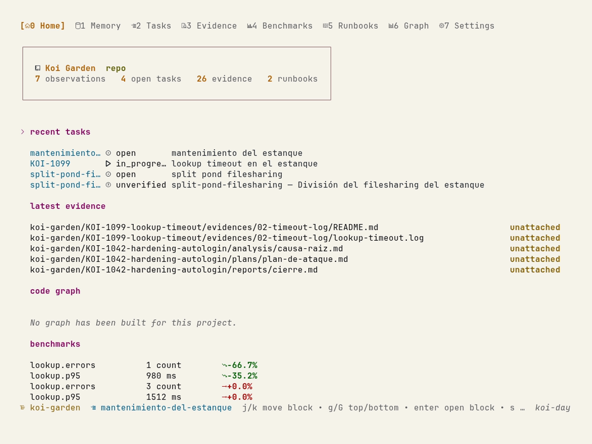 | 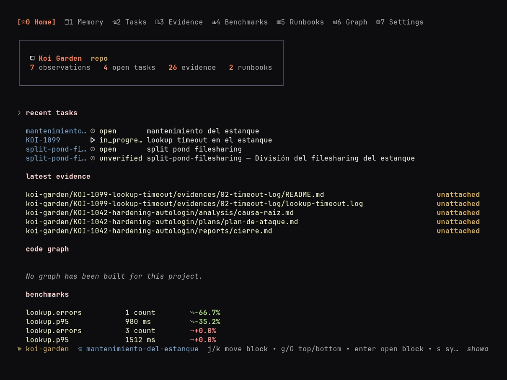 | 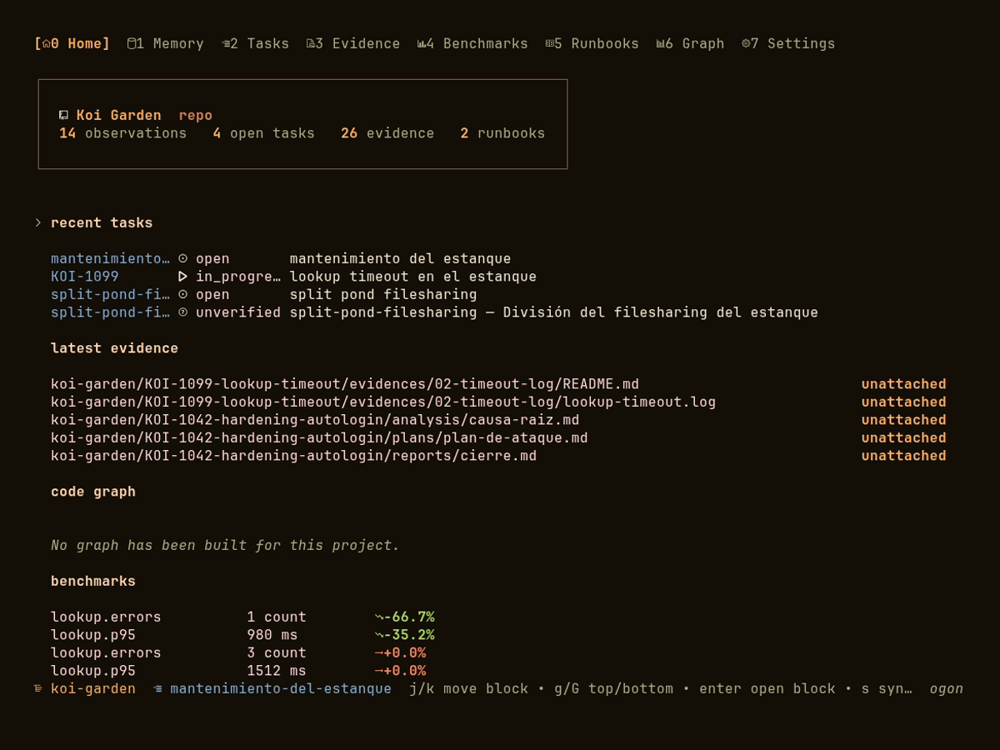 |
| 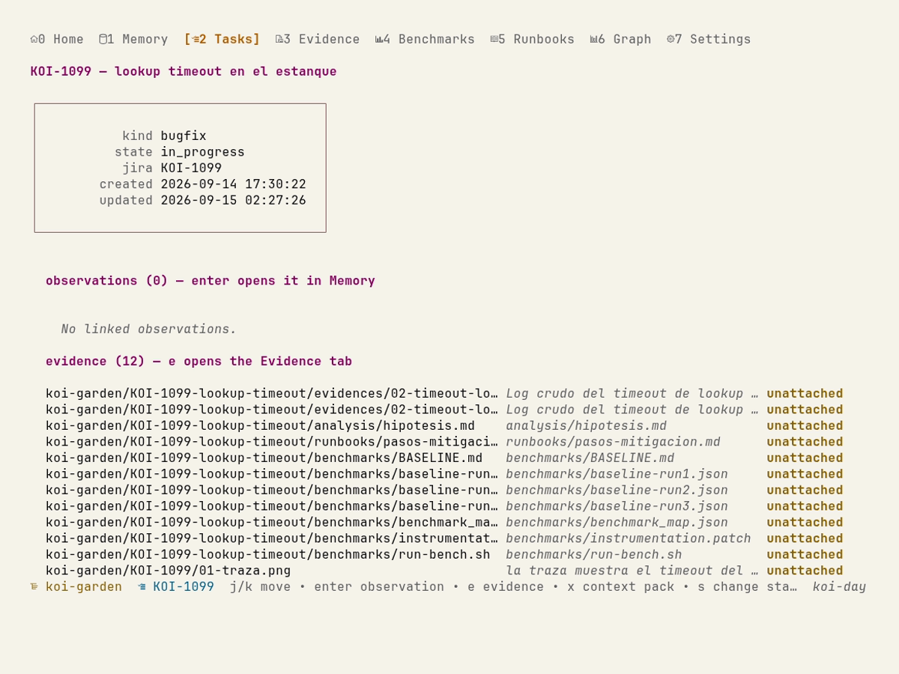 | 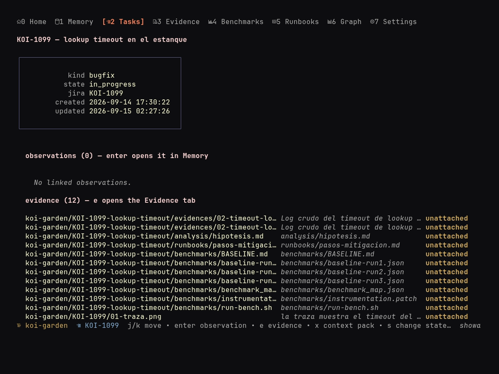 | 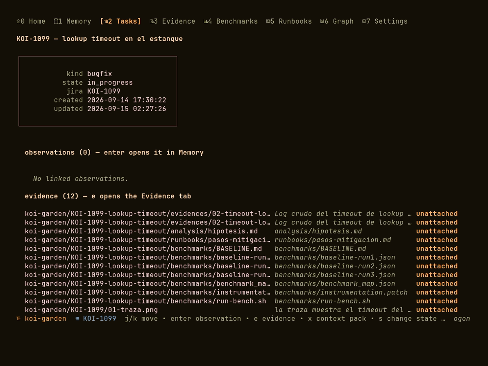 |
| 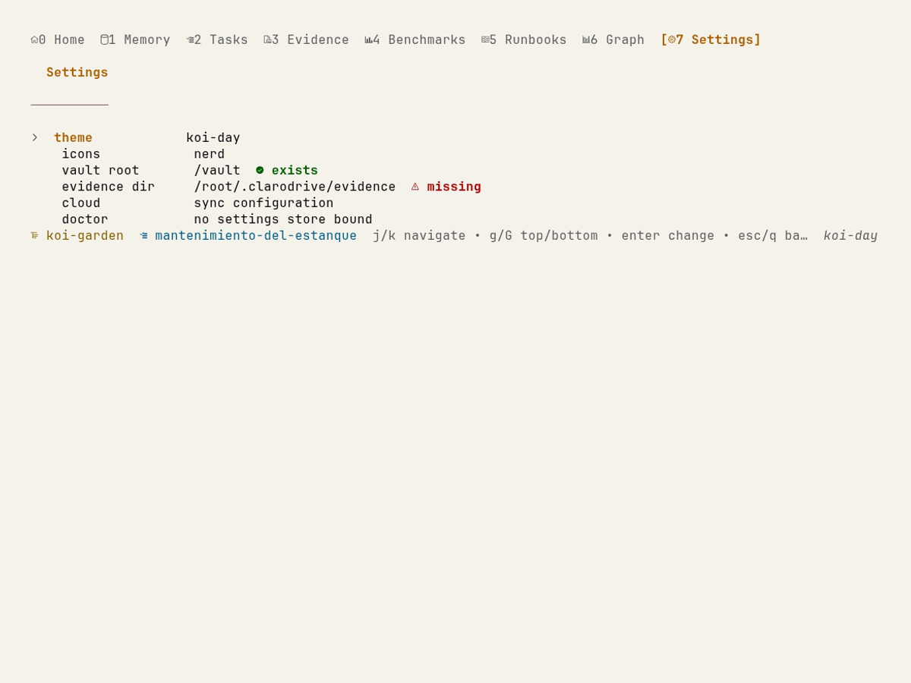 | 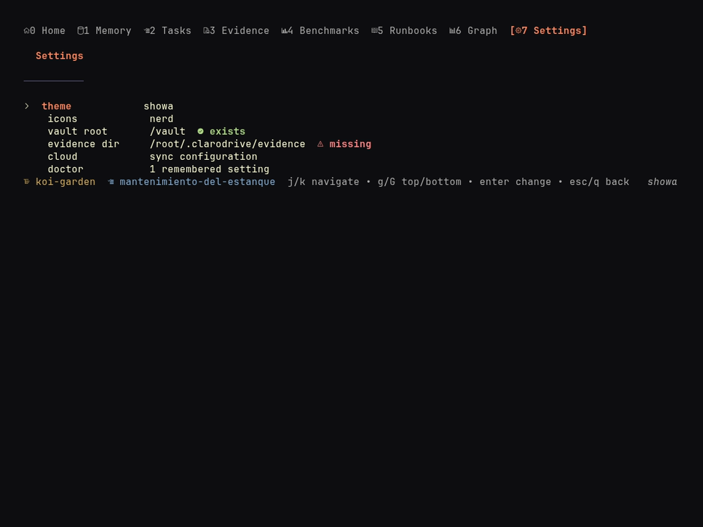 | 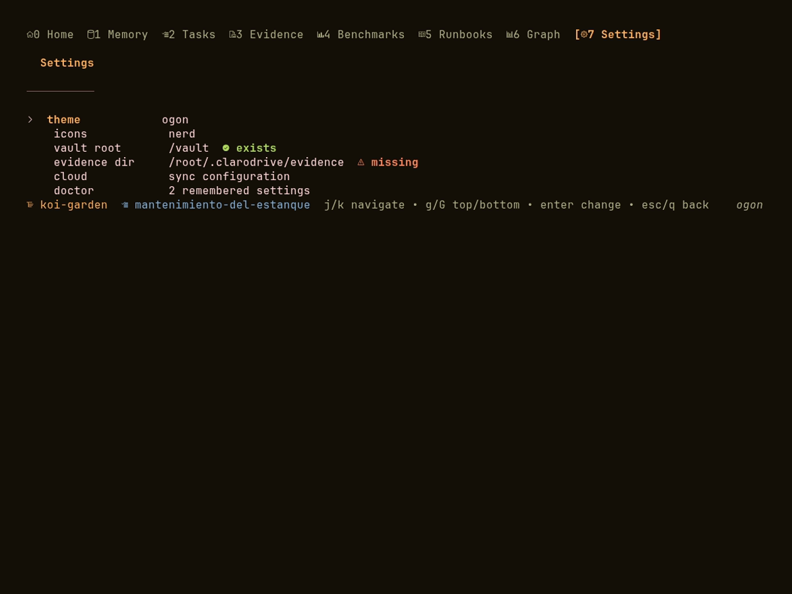 |

Palettes live in the `themes` table of `~/.engram/engram.db`, not in a configuration file. The
binary's own palettes are seeded into that table on every start, so a palette a later version ships
appears without re-running any setup — and seeding only overwrites rows still marked `source =
'builtin'`, which is what lets an edited palette survive an upgrade.

### Which palette opens

Highest priority first:

```bash
engram tui --theme kanagawa            # 1. the flag
ENGRAM_TUI_THEME=kanagawa engram tui   # 2. the environment variable
engram theme use kanagawa              # 3. settings['tui.theme']
```

4. `tui.theme` in `<data-dir>/config.json` — `~/.engram/config.json` unless `ENGRAM_DATA_DIR` moves
   it:

   ```json
   { "tui": { "theme": "kanagawa" } }
   ```

5. `koi-pond`, the default.

A name no theme answers to falls back to `koi-pond` and prints a warning to stderr rather than
failing silently. A stored palette that is not a readable theme document is named on stderr and
ignored; the rest still load.

### The theme picker

`ctrl+t` opens the picker from any screen — as does `enter` on the Settings tab's `theme` row.

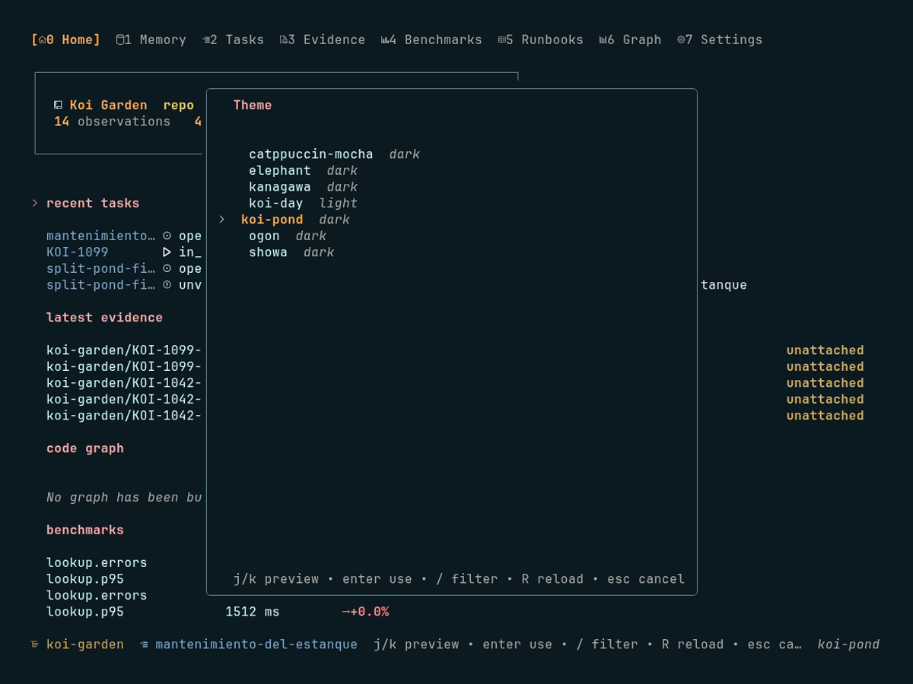

- `j` / `k` **previews**: the whole workspace repaints in the theme under the cursor, without
  writing anything down. A theme is judged by looking at the workspace in it, not by reading a name.
- `enter` applies it and writes `tui.theme`.
- `esc` closes and restores the palette that was showing when the overlay opened.
- `R` re-reads the `themes` table. That is how a palette edited in SQL, or added by `engram theme
  import`, appears without restarting the workspace.
- A theme that cannot be decoded is still listed — hiding it would leave somebody wondering where
  it went — drawn in the danger colour, and refuses to be chosen, with the reason in the notice.

### engram theme

```bash
engram theme list                                  # every theme, its variant, source and problems
engram theme show koi-pond                         # the 13 roles and the logo gradient, with contrast ratios
engram theme use koi-pond                          # remember it as the one the TUI opens on
engram theme export koi-pond --out koi-pond.json   # write it as a document
engram theme import koi-pond.json --name mine      # add one  [--name N] [--force]
engram theme reset koi-pond                        # put it back the way this build ships it
```

Every subcommand takes `--json`. `import` refuses a palette that fails contrast validation unless
`--force` is given. `reset` restores a palette the binary ships; a theme this build does not ship
is removed instead, because "the way it shipped" only exists in the binary.

### The theme document

This is what `engram theme export` emits, and what `import` accepts: a name, the variant it was
built for (`dark` or `light`), the thirteen roles by name, and the five gradient stops of the
wordmark. All thirteen roles are required — a document missing one is refused by name rather than
decoding into an invisible colour.

```json
{
  "name": "koi-pond",
  "variant": "dark",
  "palette": {
    "accent": "#ecc369",
    "base": "#0d1b21",
    "danger": "#f4787f",
    "highlight": "#7fe0d4",
    "info": "#74bde0",
    "overlay": "#57808c",
    "primary": "#ff9e5e",
    "secondary": "#f4a8c0",
    "subtext": "#9fb6bd",
    "success": "#96cf7f",
    "surface": "#16272f",
    "text": "#e6edef",
    "warning": "#e9b949"
  },
  "logo_gradient": ["#e6edef", "#ecc369", "#ff9e5e", "#f4787f", "#7fe0d4"]
}
```

`palette` is a JSON object, so the roles come out alphabetically; the order that matters is the
grouping `engram theme show` prints them in — the two planes and the separator (`base`, `surface`,
`overlay`), the two copy weights (`text`, `subtext`), the four brand roles (`primary`,
`secondary`, `accent`, `highlight`), then the four state roles (`success`, `warning`, `danger`,
`info`). The ten text roles among them are held to a legibility bar against both planes, and
`engram theme show` marks any that fall under it.

`logo_gradient` is exactly five stops, one per row of the wordmark, and the koi palettes derive
theirs from roles they already carry: `text`, `accent`, `primary`, `danger`, `highlight`. A
document with any other number of stops is refused.

### Editing a palette in SQL

The table is the source of truth, so a palette can be changed in place:

```bash
sqlite3 ~/.engram/engram.db "UPDATE themes SET palette = json_set(palette, '$.palette.primary', '#ff8a3d'), source = 'sql', updated_at = datetime('now') WHERE name = 'koi-pond';"
```

Then `ctrl+t` and `R` inside a running workspace to see it, or just start `engram tui` again.
Setting `source = 'sql'` is what keeps the next start from seeding the shipped palette back over
the edit.

To undo it:

```bash
engram theme reset koi-pond
```

## Icons

Every glyph the workspace draws comes from one of three vocabularies, and each occupies exactly one
terminal cell in all three, so the column solver lines up either way.

| Mode | What it uses |
| --- | --- |
| `unicode` | The basic multilingual plane — any UTF-8 terminal, no patched font. The default. |
| `nerd` | The private-use codepoints a Nerd Font patches its icons into. |
| `ascii` | Nothing above `0x7e`, for a terminal that cannot be trusted with more. |

```bash
ENGRAM_TUI_ICONS=nerd engram tui
```

Resolution order: `ENGRAM_TUI_ICONS`, then `settings['tui.icons']`, then the terminal itself. An
unrecognised value in either of the first two tiers is not honoured as a choice — it falls through
to the next tier rather than acting on a typo.

The environment can only ever **downgrade**: a `TERM` of `dumb`, or a locale that does not say
UTF-8, resolves to `ascii`. `nerd` is **never** inferred — there is no reliable way to detect a
patched font, and guessing wrong fills the screen with replacement characters — so it must be asked
for, by the variable, by the setting, or by cycling the Settings tab's `icons` row (which changes
the vocabulary for the session but cannot write the setting — see [7 · Settings](#7--settings)).

## What the workspace remembers

Remembered choices live in the `settings` table of `~/.engram/engram.db`. They are written off the
render path, and a failed write raises nothing: the workspace is already in the state the user
asked for, and only the memory of it failed.

| Key | Written by | Read by |
| --- | --- | --- |
| `tui.last_project` | opening a project from the tree | the project resolver, below cwd detection |
| `tui.last_tab` | every tab switch, deep links included | startup — **only** when `tui.last_project` matches the project now opening |
| `tui.theme` | the theme picker's `enter`, and `engram theme use` | startup, below `--theme` and `ENGRAM_TUI_THEME` |
| `tui.icons` | by hand — the Settings tab's `icons` row tries and reports that it cannot | startup, below `ENGRAM_TUI_ICONS` |
| `tui.mouse` | by hand | startup, below `--no-mouse` |
| `tui.search_history` | opening a palette hit | startup, to seed the palette's recent queries |

`tui.last_tab` is deliberately scoped to its project: a tab is a place inside a project, not a
global preference, and opening a different project on the last one's tab would show a screen about
somebody else's work. A remembered tab this build does not implement is ignored rather than opening
on a screen that cannot be drawn.

## Regenerating the captures and the goldens

All of these run against the dev stack, never a live database; each refuses to start if it finds
one.

**Golden files** — the frozen renders the layout tests compare against:

```bash
bash scripts/dev/golden.sh --approve
```

It runs both golden mechanisms inside the pinned Go image (`TestGoldenScreens -update` in
`internal/tui/app`, `TestTeatestGoldenScreens -e2e-update` in `internal/tui/e2e`) and writes the
resulting diff to `docker/dev/out/tui/golden-diff.txt` for review. The `--approve` gate is the
point: regenerating a golden makes any rendering test pass by definition.

**Tapes** — one VHS tape per (screen, palette) pair, with the terminal colours taken from `engram
theme export` rather than typed in:

```bash
bash scripts/dev/tapes.sh            # rewrite docs/tui/tapes/
bash scripts/dev/tapes.sh --check    # fail if a tape on disk has drifted from the palettes
```

No hex value is ever hand-written outside `internal/tui/theme`; edit a palette, re-run this, and
every tape follows.

**Rendering one tape to a PNG**:

```bash
docker compose -f docker-compose.dev.yml --profile shots run --rm vhs tapes/home-koi-pond.tape
```

The PNG lands in `docker/dev/out/tui/`; copy the ones worth keeping into `docs/tui/img/` under the
same name.

**tmux captures** — every scene at 80×24 and 120×40, as text and as raw ANSI:

```bash
bash scripts/dev/tui-shots.sh
```

It asserts three things per scene: no line overflows the terminal it was drawn for, the frame was
drawn with the palette the run asked for, and every background colour belongs to that palette. It
also proves, across two runs, that the Runbooks Markdown view repaints its syntax-highlighted code
block when the palette changes. Output goes to `docker/dev/out/tui/`.

**The guard** — a golden file never moves without a picture of it:

```bash
bash scripts/dev/golden-guard.sh HEAD~1..HEAD
bash scripts/dev/golden-guard.sh --warn HEAD~1..HEAD   # report without failing
```

Given a git range, it fails when the range rewrites a TUI golden without touching `docs/tui/img/`.
It does not check that the capture matches the golden — nothing short of rendering both could —
what it enforces is that the author looked.

## Troubleshooting

- **The Runbooks Markdown view says `ENGRAM_VAULT_ROOT` is not set.** It has no default; export it
  to your local clone of the knowledge vault. See [Runbooks](#5--runbooks).
- **It says the runbook is not cloned locally, but I do have the vault.** The message names the
  checkout it looked under; confirm that is where your clone actually lives.
- **The Settings tab shows the vault root or evidence dir as *missing*.** The path is configured but
  nothing is there — that is the single most common reason the workspace looks empty.
- **The interface is full of replacement characters.** The terminal's font has no Nerd Font glyphs.
  Run with `ENGRAM_TUI_ICONS=unicode` (or `ascii`), or cycle the Settings tab's `icons` row.
- **The mouse took my text selection away.** Hold `shift` while dragging, or start with
  `--no-mouse`. See [Mouse](#mouse).
- **A theme I edited in SQL does not show up.** Press `R` in the theme picker to re-read the table;
  if the edit vanished after a restart, the row was still `source = 'builtin'` and the seed put the
  shipped palette back. Set `source = 'sql'` in the same statement.
- **A tab is empty and everything else works.** Most tabs are project-scoped; only Memory reads
  workspace-wide. Press `ctrl+p` and open a project.
- **No screen renders, or it renders wrong.** Confirm which `engram` is actually running: a
  Homebrew-installed binary earlier on `$PATH` can shadow one built from source. `engram version`
  prints exactly what you are running.
