[← Back to README](../README.md)

# Terminal UI

- [Install and launch](#install-and-launch)
- [Choosing a project](#choosing-a-project)
- [The five tabs](#the-five-tabs)
  - [Memory](#memory)
  - [Tasks](#tasks)
  - [Evidence](#evidence)
  - [Runbooks](#runbooks)
  - [Cloud](#cloud)
- [Chrome: tabs, help, global keys](#chrome-tabs-help-global-keys)
- [Themes](#themes)
- [Troubleshooting](#troubleshooting)

---

`engram tui` is a project workspace, not just a memory browser: a project selector, a per-project
dashboard, and five tabs — **Memory**, **Tasks**, **Evidence**, **Runbooks**, **Cloud** — that turn
the `project_cards` / `tasks` / `evidence` / `runbook_index` tables engram already tracks into
something you navigate without leaving the terminal.

This page describes what the binary actually does. Every screenshot below was captured from a real
build of this checkout running against seeded, throwaway data — not mocked up.

## Install and launch

```bash
brew install HoracioEspinosa/tap/engram-custom
```

No `--cask`: the tap ships a Homebrew **formula** for both macOS and Linux. See
[INSTALLATION.md](INSTALLATION.md) for the other install paths (source, downloaded binary, Windows).

Once installed:

```bash
engram tui
```

## Choosing a project

<p align="center">
  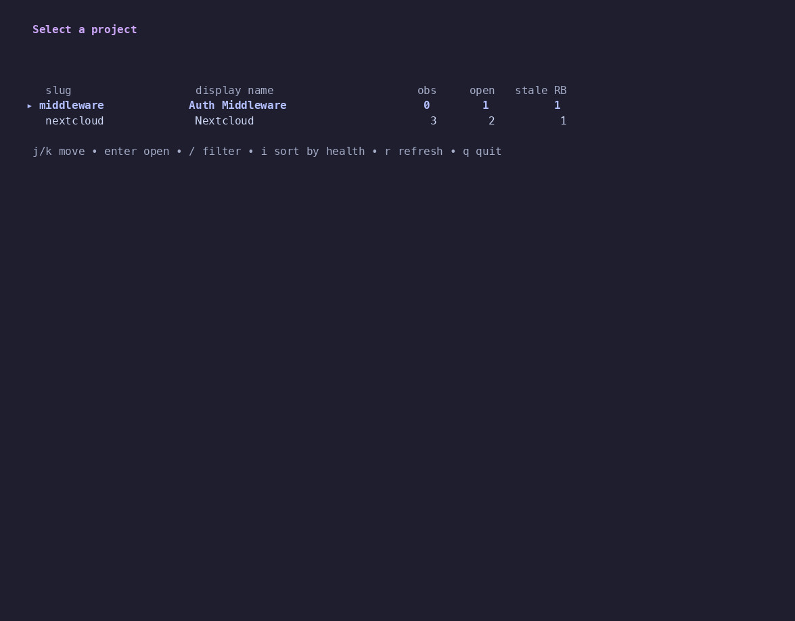
</p>

`engram tui` resolves which project to open in this order:

1. An explicit `--project <slug>` flag.
2. The `ENGRAM_PROJECT` environment variable.
3. The project detected from the current directory — only when that detection is backed by an
   actual git remote or repo root, never a bare directory-name guess. A guess is treated the same
   as no detection at all.

If none of those resolve, `engram tui` opens straight on the **Project Selector** shown above:
every enrolled `project_cards` row with its health counters (observations, open tasks, stale
runbooks). `Enter` activates the highlighted project; `/` filters the list; `i` sorts by health
instead of name.

Once a project is active you land on its **Dashboard** — the project card, counters, recent tasks,
stale runbooks and latest evidence, all with real counts:

<p align="center">
  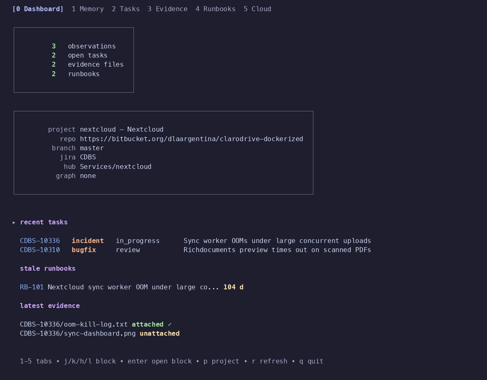
</p>

Press `p` from anywhere to reopen the selector and switch projects; `0` returns to the Dashboard
from any tab.

## The five tabs

Digits `1`–`5` jump straight to a tab and refresh it; `Tab` / `Shift+Tab` cycle through them in
order. The active tab is highlighted in the bar at the top of every screen.

### Memory

`1` opens **Memory** — the original engram screens (search, recent observations, sessions,
timeline, setup), unchanged, now living inside the workspace as one tab among five:

<p align="center">
  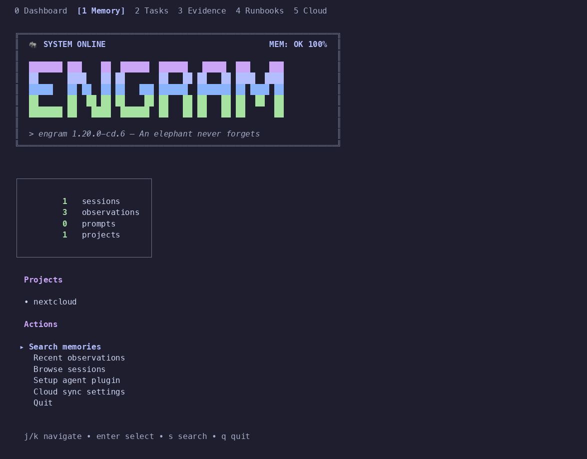
</p>

### Tasks

`2` lists the project's tasks, filterable by `state` (`f`) and `kind` (`K`), searchable with `/`:

<p align="center">
  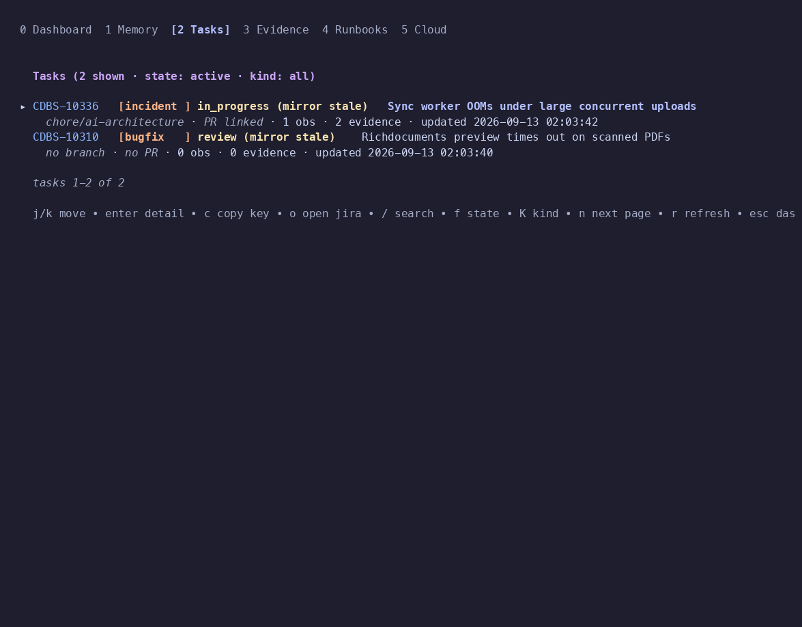
</p>

`Enter` opens a task's detail: its Jira fields, branch and PR, the observations linked to it, and
its evidence:

<p align="center">
  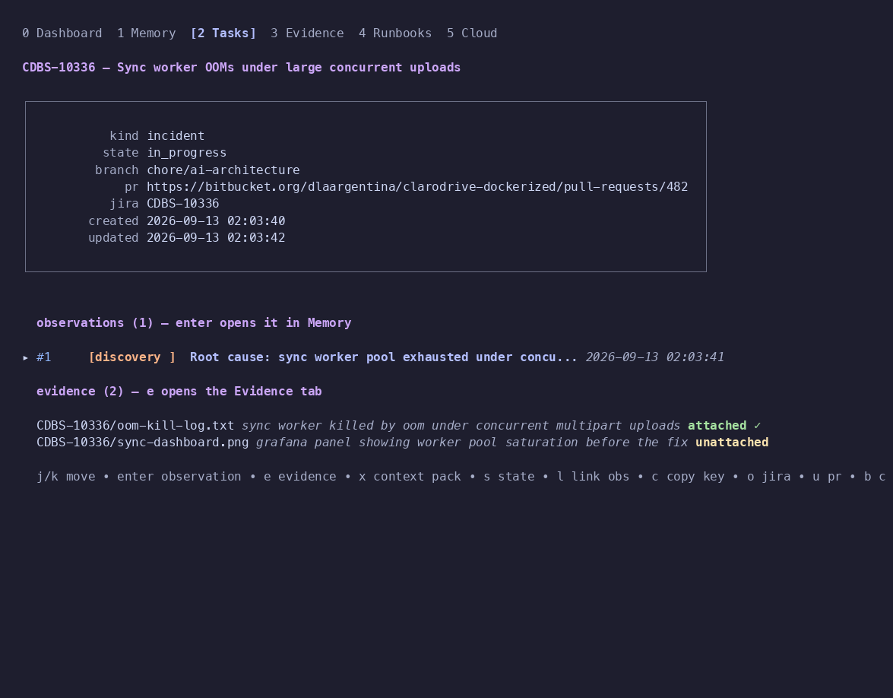
</p>

From a task's detail, `x` builds its **Context Pack** — the same bundle
`mem_context_pack` returns, rendered here for reading, copying (`c`, via OSC 52) or writing to
disk (`w`):

<p align="center">
  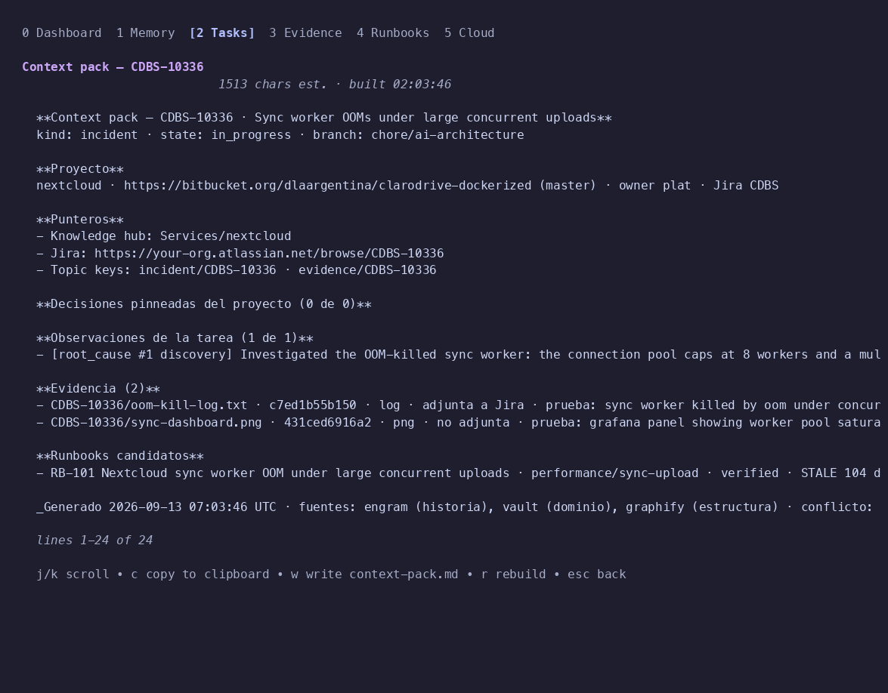
</p>

The Context Pack's own body is written in Spanish (`**Proyecto**`, `**Observaciones de la
tarea**`, …) regardless of the workspace chrome around it — that mirrors ClaroDrive's own
documentation-language convention (prose in Spanish, interface and code in English), not a
translation bug.

### Evidence

`3` lists the evidence captured for the project, optionally filtered to one task (`t`) or to
attached-only (`a`):

<p align="center">
  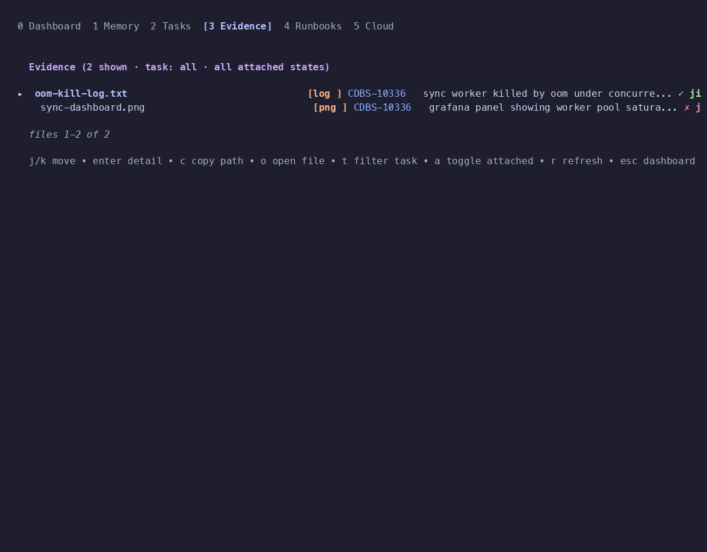
</p>

`Enter` opens a file's full record — path, sha256, size, what it proves, and whether it is
already attached to the Jira issue:

<p align="center">
  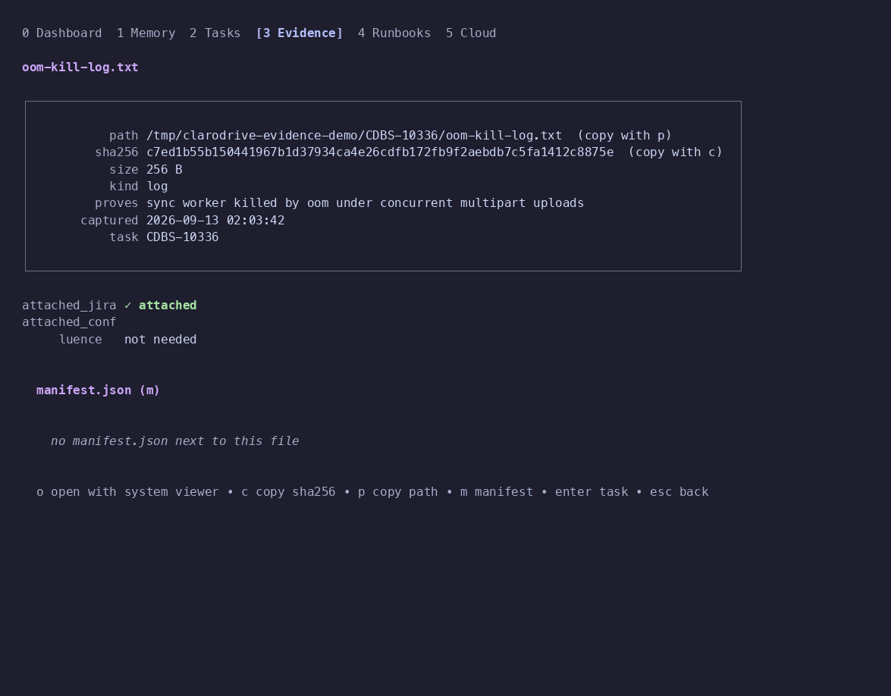
</p>

`o` opens the file with the OS's own viewer (`open` / `xdg-open`); if that fails (for example over
SSH with no desktop), the status bar shows the path instead and `c` / `p` copy the sha256 or path.

### Runbooks

`4` lists the project's runbook index — `RB-NNN`, category, pattern, status, and a `stale`
warning badge with its age in days:

<p align="center">
  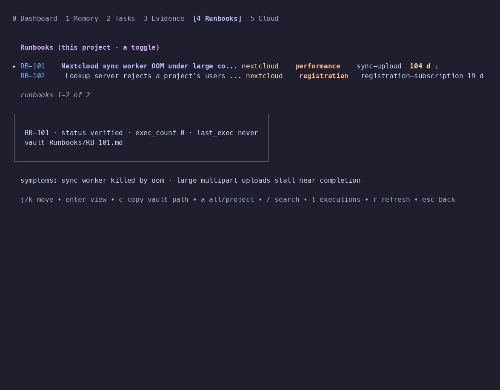
</p>

`a` toggles between this project and every project; `/` searches titles and symptoms.

`Enter` opens the runbook's body, read from the knowledge vault and rendered with `glamour`:

<p align="center">
  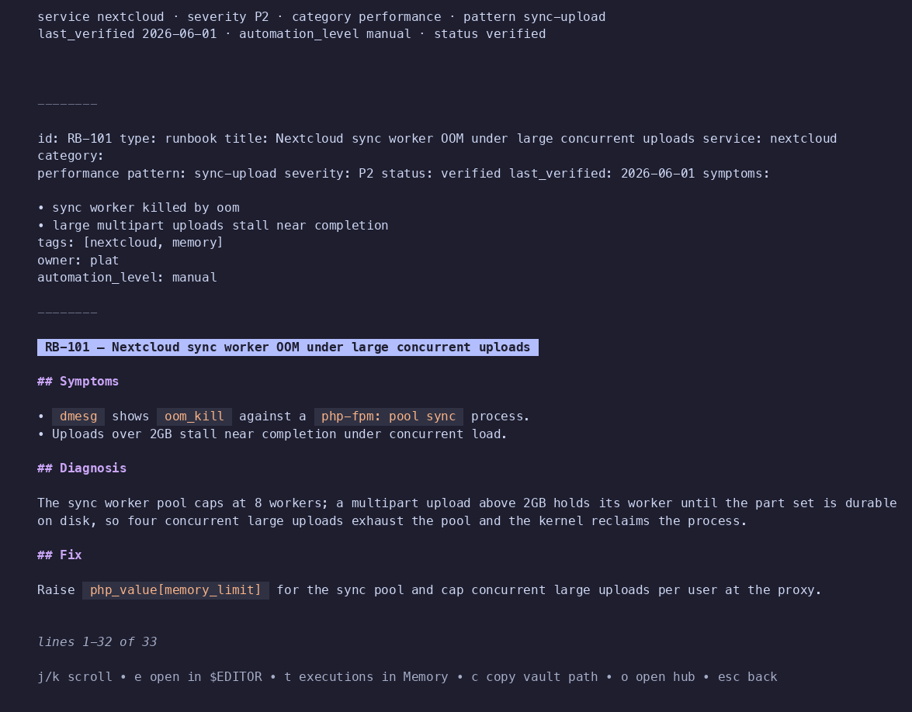
</p>

**`ENGRAM_VAULT_ROOT`**: this view reads the runbook's Markdown file from a local checkout of the
knowledge vault (`cd-knowledge-mcp`), joined with the row's own `vault_path`. The checkout root is
`ENGRAM_VAULT_ROOT` when set; otherwise the binary guesses
`~/Projects/ClaroDrive/clarodrive-knowledge-mcp/vault/clarodrive`, which only matches a machine
that happens to clone the vault at exactly that path. On any other layout the guess resolves to a
directory that doesn't exist, and the view shows "not cloned locally" — a message that reads
identically whether the vault genuinely isn't cloned or the guess was simply wrong. If your clone
lives anywhere else, **set `ENGRAM_VAULT_ROOT` to it explicitly**; don't rely on the default.

Rendering also does not strip the note's own YAML frontmatter before handing it to `glamour`, so
the block above the title (`id:`, `symptoms:`, `tags:`, …) repeats, as plain text, the same
metadata the styled summary line already shows above it. Harmless, but worth knowing before you
assume it's a copy-paste artifact of this guide.

`e` opens the file in `$EDITOR`; `t` jumps to Memory searching for that runbook's prior executions;
`o` opens the project's knowledge hub.

### Cloud

`5` opens the existing cloud sync settings — configure the server, check status, enroll projects:

<p align="center">
  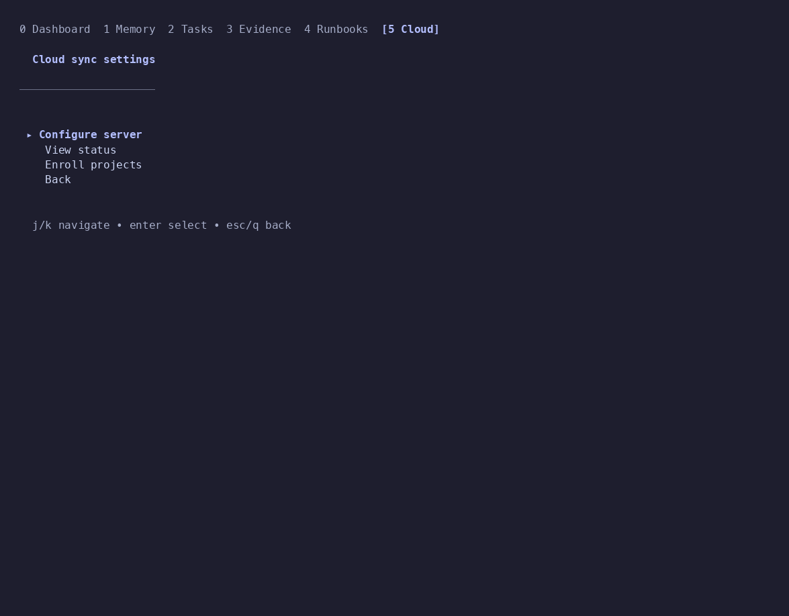
</p>

## Chrome: tabs, help, global keys

These keys work from any screen (unless a text field has focus, in which case only `Ctrl+C` and
`Esc` still apply):

| Key | Action |
| --- | --- |
| `0` | Project Dashboard |
| `1` … `5` | Jump to Memory / Tasks / Evidence / Runbooks / Cloud |
| `Tab` / `Shift+Tab` | Next / previous tab |
| `p` | Project Selector |
| `r` | Refresh the current screen |
| `?` | Help overlay — the keys the *current* screen actually answers to, not a fixed list |
| `g` / `G` | Top / bottom of the current list |
| `q` | Back a level; quits from the Dashboard |
| `Esc` | Back a level, never quits |
| `Ctrl+C` | Quit immediately, from anywhere |

Below 100 columns the tab bar drops the labels and shows only the digits (`0 1 2 3 4 5`).

## Themes

Three palettes ship today: `catppuccin-mocha` (default), `kanagawa`, and `elephant` (the original,
hardcoded look this TUI shipped with before theming existed). Precedence, highest first:

```bash
engram tui --theme kanagawa          # 1. explicit flag
ENGRAM_TUI_THEME=kanagawa engram tui # 2. environment variable
```

3. `tui.theme` in `~/.engram/config.json` (or `$ENGRAM_DATA_DIR/config.json`):

```json
{ "tui": { "theme": "elephant" } }
```

An unrecognized theme name falls back to `catppuccin-mocha` and prints a warning to stderr instead
of failing silently.

## Troubleshooting

- **The Runbooks Markdown view says "not cloned locally" but I do have the vault cloned.** See
  [`ENGRAM_VAULT_ROOT`](#runbooks) above — the default path is a guess, and yours almost certainly
  lives somewhere else.
- **No screen renders, or it renders wrong.** Confirm which `engram` is actually running: a
  Homebrew-installed binary earlier on `$PATH` can shadow one you built from source. `engram
  version` prints exactly what you're running.
